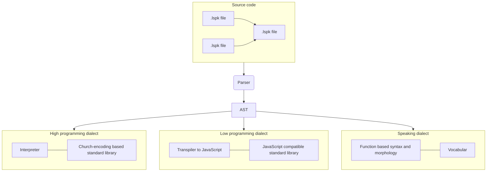

# Lispeak

Lispeak is a constructed language in which a text can be both a computer program and natural speech. <br/>

It is inspired by:

- [Lambda-calculus](https://en.wikipedia.org/wiki/Lambda_calculus)
- [Lisp](https://en.wikipedia.org/wiki/Lisp)
- [Lojban](https://en.wikipedia.org/wiki/Lojban)
- [Group theory](https://en.wikipedia.org/wiki/Group_theory)

Originally the idea of this language was described and explained in [this post](https://habr.com/ru/articles/902574) of mine (in Russian)



## Goals

The main goal of this project is to create a constucted language that is programming and speaking language at the same time:

- Grammar is based on functions
- Grammar is fully described in Lispeak itself
- Grammar development is git-based
- Every sentence is an S-expression
- Every sentence can be spoken
- Every sentence can be executed on computer
- Every word is based on symmetries of the group theory
- Language is transpiled to JavaScript
- Language is fully compatible with any natural language (you can use words from your language)
- Language sounds well

## Plan

- **Phase 1**: Develop core: lexer and parser that turn Lispeak text to AST
- **Phase 2**: Develop interpreter and standard library based on Church encoding (high programming dialect)
- **Phase 3**: Develop transpiler to JavaScript with compatibility with JavaScript syntax and standard library (low programming dialect)
- **Phase 4**: Develop syntax and morphology rules for spoken language (speech dialect)
- **Phase 5**: Develop docs and tools to translate Lispeak text to speech

## Core

The core of Lispeak is based on Lambda calculus.

### Expressions

Every expression in Lispeak is application of functions. E.g. the following means applying function `a` to parameters `b` and `c`:

```
(a b c)
```

### Named expressions

You can create named expressions with left arrow `<-`. E.g. in the following example we create expression named `a` with value `1`:

```
(<- a 1)
```

### Lambda functions

You can create lambda functions with right arrow `<-`.

```
(-> a b (+ a b))
```

You can name this function:

```
(<- sum (-> a b (+ a b)))
```

### Imports and exports

Each `.lspk` file has exactly one export that you can import in another files.

Let's say we have a file called `module2.lspk`

```
(<- sum (-> a b (+ a b)))

~> sum
```

In another file called `module1.lspk` we can do:

```
(<- sum (<~ './module2'))
```

Or more simplified:

```
<~ sum './module2'
```

## Grammar

### Alphabet

Alphabet of Lispeak is mostly taken from Lojban with a few small changes.

```
abcdefghijklmnoprstuvxyz
```

#### Consonants

| Symbol | Description                   | Example Word     | Russian Equivalent |
| ------ | ----------------------------- | ---------------- | ------------------ |
| b      | Voiced bilabial stop          | bagel            | б                  |
| c      | Unvoiced coronal sibilant     | <b>sh</b>ark     | ш                  |
| d      | Voiced dental/alveolar stop   | desk             | д                  |
| f      | Unvoiced labial fricative     | fat              | ф                  |
| g      | Voiced velar stop             | great            | г                  |
| h      | Unvoiced velar fricative      | Ba<b>ch</b>      | х                  |
| j      | Voiced coronal sibilant       | mea<b>s</b>ure   | ж                  |
| k      | Unvoiced velar stop           | kill             | к                  |
| l      | Voiced lateral approximant    | lake             | л                  |
| m      | Voiced bilabial nasal         | maybe            | м                  |
| n      | Voiced dental or velar nasal  | neck             | н                  |
| p      | Unvoiced bilabial stop        | pepper           | п                  |
| r      | Rhotic sound                  | river            | р                  |
| s      | Unvoiced alveolar sibilant    | snake            | с                  |
| t      | Unvoiced dental/alveolar stop | tarp             | т                  |
| v      | Voiced labial fricative       | vast             | в                  |
| x      | Voiceless palatal affricate   | <b>ch</b>ipotle  | ч                  |
| y      | Voiced palatal approximant    | may / (fr.) Paul | й/ь                |
| z      | Voiced alveolar sibilant      | ooze             | з                  |

#### Vowels

| Symbol | Description       | Example Word | Russian Equivalent |
| ------ | ----------------- | ------------ | ------------------ |
| a      | Open vowel        | father       | а                  |
| o      | Back mid vowel    | open         | о                  |
| e      | Front mid vowel   | bet          | э                  |
| u      | Back close vowel  | moon         | у                  |
| i      | Front close vowel | machine      | и                  |

With help of the `y` consonant we can create derivative vowels:

| Symbol | Description      | Example Word | Russian Equivalent |
| ------ | ---------------- | ------------ | ------------------ |
| ya     | Open vowel       | yard         | я                  |
| yo     | Back mid vowel   | yoga         | ё                  |
| ye     | Front mid vowel  | yes          | е                  |
| yu     | Back close vowel | use          | ю                  |

#### Special signs

| Symbol | Description                               | Example Word | Russian Equivalent |
| ------ | ----------------------------------------- | ------------ | ------------------ |
| '      | stop or a pause in the middle of the word |              | ъ                  |

### Symbols

In Lispeak you can use symbols in text that have defined pronounciation:

| Symbol | Pronounciacion | Meaning           |
| ------ | -------------- | ----------------- |
| `(`    | u              | Left parenthesis  |
| `)`    | yu             | Right parenthesis |
| `<-`   | o              | Define            |
| `->`   | yo             | Function          |
| `<~`   | eo             | Import            |
| `~>`   | eyo            | Export            |

### Syntax

The Lispeak language is based on minimalistic syntax core.

#### Application

All sentenses in Lispeak are S-expressions of application operation to operands in prefix notation just like in Lisp:

```
(operation operand1 operand2 operand3)
```

So `I love you` in Lispeak is like `(love I you)`.

#### Definition

The most commonly use operation is definition of equality that is used for creating named expressions. It uses symbol `=` or word `o`.

```
(<- {left} {right})
```

It means `left equals right`
E.g. to say `Alice is a doctor`:

```
u o elis doktor yu
```

#### Function

Labmda functions are defined with symbol `->` and word `yo` like:

```
(-> (a b) (+ a b))
```

### Morphology

The basic idea of Lispeak morphology are symmetries. In language there're a lot of words with opposite meanings. In Lispeak these words come from one root in different morphological forms. So many roots have left and right forms like:

| Left     | Right     |
| -------- | --------- |
| left     | right     |
| down     | up        |
| back     | forward   |
| negative | positive  |
| ugly     | beautiful |
| dark     | light     |
| minus    | plus      |
| from     | to        |
| pull     | push      |
| no       | yes       |
| static   | dynamic   |
| war      | peace     |

It will be created later
